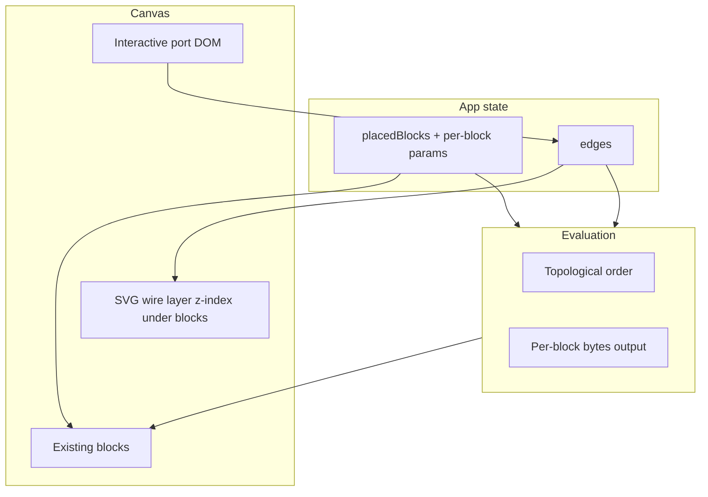

# Interactive wires between inputs and converters (with data flow)

## Current state

- Placed blocks live in [`../src/App.jsx`](../src/App.jsx) as `{ id, type, x, y }`; dragging uses pointer capture on [`../src/canvas-placed-block.jsx`](../src/canvas-placed-block.jsx).
- Visual notches exist only in some blocks: input blocks use a **CSS `::after`** bottom notch ([`../src/App.css`](../src/App.css) `.input-block--with-bottom-notch`), so there is **no DOM target** for hit-testing or measuring. Split uses real `.notch-port` spans but `.notch-ports-row` has `pointer-events: none`.
- Converters like [`../src/converter-block/format-convert-block.jsx`](../src/converter-block/format-convert-block.jsx) and [`../src/converter-block/join-lots-block.jsx`](../src/converter-block/join-lots-block.jsx) have **no top/bottom notch UI** yet (join copy explicitly says wiring comes later).
- No React Flow / graph library in [`package.json`](../package.json); implementation stays **plain React + SVG**.

## Architecture

**Coordinates:** Render an SVG overlay inside `.grid-canvas` (`position: absolute; inset: 0; width/height 100%`; `pointer-events: none` on the SVG, **`pointer-events: auto`** on port hit targets). Compute each port’s center with `getBoundingClientRect()` relative to the canvas element so lines stay aligned when **scrolling, resizing, or moving blocks**. Re-measure on scroll/resize and after block moves (same listeners you already use for the minimap viewport, plus a callback after `movePlacedBlock`).

**Edges model** (keep stable IDs for React keys and deletion):

- `edge = { id, from: { blockId, portKey }, to: { blockId, portKey } }`
- **Port keys** (examples): single output `out`; single input `in`; split outputs `out:0`…; join inputs `in:0`… (derived from block params).

**Interaction:**

1. `pointerdown` on an **output** port (only when **not** `draggableToCanvas` palette mode): record `{ sourceBlockId, sourcePortKey }`, capture pointer, `stopPropagation()` so canvas pan does not steal the gesture.
2. `pointermove`: rubber-band Bézier from source port center to pointer (or a ghost target).
3. `pointerup` over a compatible **input** port: push a new edge (or **replace** an existing edge into that same input port). Reject self-connections and **cycles** (quick DFS from target back to source on proposed edge).
4. Optional UX: `pointerup` elsewhere cancels; double-click edge or Delete key could remove (only if you want—mention as small follow-up if timeboxed).

**Bézier path:** Cubic curve from `(x1,y1)` to `(x2,y2)` with control points offset vertically (e.g. `C (x1,y1+h1) (x2,y2-h2) (x2,y2)` with `h1,h2` ~ 40–80px) so horizontal stacking still looks like a node editor.

## Port topology and block state lifting

To wire **and** propagate data, dynamic converters need **stable port counts** and **evaluable inputs**:

| Block kind                       | Inputs                           | Outputs    | Notes                                                              |
| -------------------------------- | -------------------------------- | ---------- | ------------------------------------------------------------------ |
| Input (binary/hex/decimal/ascii) | 0                                | 1× `out`   | Replace `::after` with a real port element for canvas instances    |
| formatConvert                    | 1× `in`                          | 1× `out`   | Add split-style notch row top/bottom for placed blocks             |
| splitIntoLots                    | 1× `in`                          | N× `out:i` | Already has notch rows; enable pointer events; N from lifted param |
| joinLots                         | K× `in:i`                        | 1× `out`   | Add notch UI; K from lifted param                                  |
| Operations                       | 2× `in:a`, `in:b` (or 3 for mod) | 1× `out`   | Add simple top/bottom ports for placed blocks                      |
| output                           | 1× `in`                          | 0          | Top input only                                                     |

**Placed block shape** extension in App (minimal fields per type):

- Common: `{ id, type, x, y }`
- `splitIntoLots`: `blockCount` (number)
- `joinLots`: `joinCount` (number)
- Others: no extra fields initially unless needed

Pass **`blockId`**, **`placement="canvas"` vs `"palette"`**, **`params`**, and **`wiredValues` / evaluation props`** into blocks via [`../src/canvas-placed-block.jsx`](../src/canvas-placed-block.jsx) by wrapping each `Block` with shared props instead of editing every palette reference by hand (palette keeps current behavior: `draggableToCanvas` only).

## Data propagation (bytes as canonical wire value)

- Define a small **`evaluateGraph(placedBlocks, edges)`** (new module e.g. [`../src/graph/evaluate-graph.js`](../src/graph/evaluate-graph.js)):
    - Parse **input blocks** using existing helpers from [`../src/converter-block/format-bytes.js`](../src/converter-block/format-bytes.js) (`parseBytesFromFormat` per block type).
    - Build adjacency from edges; **topological sort**; detect cycles (fail evaluation with clear fallbacks).
    - For each node in order, compute **outputs as `Uint8Array`** (or shared empty sentinel): format convert, split/join semantics using existing parse/serialize where possible; operations use [`../src/operations-block/operation-definitions.js`](../src/operations-block/operation-definitions.js) semantics once operands exist (may require small eval helpers per op).
- Pass **computed inputs** into canvas blocks: e.g. format convert **prefers wired bytes** when an edge hits `in`, else falls back to manual textarea; join expects multiple inputs ordered by `in:0…`.
- **Output block**: display serialized representation of wired input (e.g. hex) for quick verification.

This avoids a heavy global store if evaluation is **pure** from `(blocks, edges, blockParams)` and block-local **manual** fields are passed up via callbacks (`onParamsChange`) only for params that affect ports.

## Files to add / touch (concise)

- **New:** `../src/graph/edge-types.js` (types / helpers), `../src/graph/evaluate-graph.js` (DAG + byte propagation), `../src/graph/port-registry.jsx` or hooks (`usePortAnchor`, `CanvasGraphProvider`).
- **New:** `../src/canvas-wires.jsx` (SVG + rubber-band state) or co-locate in App if kept small.
- **New:** small presentational `PortHandle` component (input vs output styling).
- **Edit:** [`../src/App.jsx`](../src/App.jsx) — `edges` state, providers, SVG layer, merge drop handler to include default params for split/join.
- **Edit:** [`../src/canvas-placed-block.jsx`](../src/canvas-placed-block.jsx) — pass `blockId`, graph callbacks, `evaluation` props; ensure port `stopPropagation` coexists with existing drag.
- **Edit:** [`../src/App.css`](../src/App.css) — interactive ports (hover/active), remove pointer-events blockers on port rows for canvas-only variants (e.g. modifier class on canvas blocks).
- **Edit:** Input blocks, converters, operations, output — **canvas-only** notch rows and wiring props; keep palette markup unchanged where possible.

## Risk / edge cases

- **HTML5 drag from palette** vs **pointer-based wiring**: wiring uses pointer events on ports only; palette blocks stay `draggable` for placement.
- **z-index:** SVG under blocks (`z-index: 0`), blocks `z-index: 1` so ports remain clickable; rubber-band segment may need a temporary high z-index layer—usually drawn in same SVG on top of committed edges with thicker stroke.
- **Performance:** Re-measure ports with `requestAnimationFrame` batching on scroll/move.

## Testing manually

- Place two input blocks and a format converter; wire output → input; change input text and confirm converter output updates.
- Scroll the page and confirm wires stay glued to notches.
- Drag a connected block; wires follow.
- Attempt a cycle (A→B→A); connection should be rejected.
