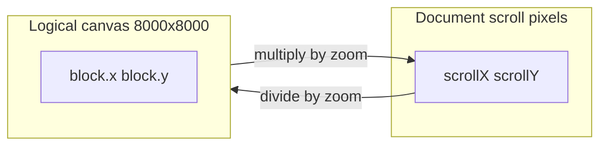

# Center initial view and wheel zoom

## Current behavior

- [../src/App.jsx](../src/App.jsx): `CANVAS_SIZE = 8000`; the canvas is a single `.grid-canvas` div with fixed pixel width/height. Panning uses **`window.scrollTo`** (pointer drag on empty canvas). Viewport state for the minimap is **`window.scrollX`, `window.scrollY`, `innerWidth`, `innerHeight`** (scroll pixel space, which equals canvas space only at zoom 1).
- [../src/index.css](../src/index.css): `body { overflow: auto }`; `#root` is `width: fit-content` so the document grows with the canvas.
- [../src/canvas-placed-block.jsx](../src/canvas-placed-block.jsx): Block position uses **`nextX = window.scrollX + event.clientX - offsetX`** (same for Y), which encodes “canvas logical X” from scroll + pointer.
- [../src/mini-map.jsx](../src/mini-map.jsx): Treats `viewport.left/top/width/height` as **canvas coordinates** for drawing the blue rectangle (via `scale = minimapSize / canvasSize`). Today that only holds when zoom is 1 because `left` is actually `scrollX`.

## 1. Initial scroll to center

- Add a **one-time** effect (e.g. `useRef` flag `didInitialScroll`) that runs after mount when `innerWidth` / `innerHeight` are known.
- Call `window.scrollTo` with:
  - `left: clamp(0, (CANVAS_SIZE * zoom - innerWidth) / 2, maxScrollLeft)`
  - `top`: same pattern vertically  
  Use the same `maxScroll*` formulas as navigation so behavior stays consistent when zoom is added (at `zoom === 1` this centers on the grid).

## 2. Zoom model (DOM)

Introduce React state `zoom` (e.g. clamped range `0.25`–`3`, initial `1`).

Wrap the existing `.grid-canvas` in an **outer** div that defines document scroll extent:

- Outer: `position: relative`, **`width: CANVAS_SIZE * zoom`**, **`height: CANVAS_SIZE * zoom`** (this is what `window` scrolls over).
- Inner (current canvas): `position: absolute; left: 0; top: 0`, keep **`width` / `height: CANVAS_SIZE`**, add **`transform: scale(zoom)`** and **`transformOrigin: '0 0'`**.

[`getBoundingClientRect()`](https://developer.mozilla.org/en-US/docs/Web/API/Element/getBoundingClientRect) on transformed elements already accounts for scale, which keeps [../src/canvas-wires.jsx](../src/canvas-wires.jsx) wire geometry aligned with port anchors as long as the SVG stays inside the scaled inner layer.

Ref assignment: move `ref={canvasRef}` to the **inner** scaled element (the coordinate space for blocks/wires), or add a dedicated ref for the outer extent—whichever you use for wheel focal math and drop targets.

## 3. Wheel handler (zoom in/out)

- Listen on **`wheel`** with **`{ passive: false }`** so you can **`preventDefault()`** and use wheel for zoom instead of native scroll (per your request).
- Map `deltaY` to an exponential step, e.g. `nextZoom = clamp(zoom * exp(-deltaY * k))`, with small `k` for smooth steps.
- **Zoom toward cursor** (preserve the canvas point under the pointer):
  - Before changing zoom, compute canvas coordinates of the pointer (document/scroll space is fine): e.g. `canvasX = (window.scrollX + event.clientX) / zoom` (and similarly for Y), assuming the canvas stack starts at the document origin like today—adjust if you add margins by subtracting the outer wrapper’s document offset once.
  - After setting `nextZoom`, set scroll so the same canvas point stays under the cursor:  
    `scrollX = canvasX * nextZoom - event.clientX` (clamp to `[0, CANVAS_SIZE * nextZoom - innerWidth]`).

Attach the listener to `window` or the outer canvas wrapper; guard so UI outside the canvas (e.g. minimap, side panel) can keep normal wheel behavior if desired, or document-wide zoom—default to **canvas area only** if you use `ref` + bounding-rect hit test.

## 4. Viewport + minimap (canvas space)

Update `updateViewport` in [../src/App.jsx](../src/App.jsx) so the minimap always receives **canvas-space** rectangle (fixes today’s subtle mismatch and supports zoom):

- `left: window.scrollX / zoom`
- `top: window.scrollY / zoom`
- `width: window.innerWidth / zoom`
- `height: window.innerHeight / zoom`

[mini-map.jsx](../src/mini-map.jsx) can stay **unchanged** if the above holds—its math already assumes canvas coordinates.

## 5. Navigation and clamping

- **`navigateFromMinimap`**: minimap already computes **canvas-space** targets; convert to scroll pixels:  
  `window.scrollTo({ left: targetLeft * zoom, top: targetTop * zoom })` with  
  `maxScrollLeft = max(0, CANVAS_SIZE * zoom - innerWidth)` (same for vertical).

## 6. Drop placement ([../src/App.jsx](../src/App.jsx) `handleCanvasDrop`)

- Use `getBoundingClientRect()` on the **inner** canvas element.
- Canvas coords: **`x = (event.clientX - rect.left) / zoom`**, **`y = (event.clientY - rect.top) / zoom`** (rect already reflects transform; dividing by `zoom` converts screen offset along the scaled canvas to logical coords—or derive equivalently from scroll + client if you prefer one consistent helper).

## 7. Block dragging ([../src/canvas-placed-block.jsx](../src/canvas-placed-block.jsx))

- Pass **`zoom`** via React context (extend [../src/graph/canvas-graph-context.jsx](../src/graph/canvas-graph-context.jsx)) **or** a small prop from `App` through `CanvasPlacedBlock`—minimal surface area.
- Replace move calculation with:

  `nextX = (window.scrollX + event.clientX - offsetX) / zoom` (and same for Y),

  which matches the current behavior at `zoom === 1` and scales pointer sensitivity correctly when zoomed.

## 8. CSS touch-ups

- Ensure the new **outer** wrapper does not break `#root` layout (`fit-content` should grow with `CANVAS_SIZE * zoom`).
- Optionally add **`overscroll-behavior: none`** on `body` if bounce interferes with zoom—only if needed.

## Files to touch

| File | Change |
|------|--------|
| [../src/App.jsx](../src/App.jsx) | Zoom state, outer wrapper, initial center scroll, wheel listener, viewport math, minimap navigate + drop coords |
| [../src/canvas-placed-block.jsx](../src/canvas-placed-block.jsx) | Use `zoom` in drag formula |
| [../src/graph/canvas-graph-context.jsx](../src/graph/canvas-graph-context.jsx) | Optional: expose `zoom` for blocks |
| [../src/App.css](../src/App.css) | Optional class for outer extent / inner scaled canvas if needed beyond inline styles |

No change required to [../src/mini-map.jsx](../src/mini-map.jsx) if viewport is passed in canvas space.
