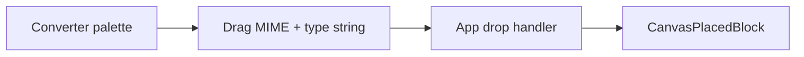

# Converter panel and converter blocks

## Current behavior

- Expandable side panel labels live in [`../src/side-panel-expandable-panels.jsx`](../src/side-panel-expandable-panels.jsx): only `'Input'` renders real content (`InputBlocks`); `'Panel 2'` shows a placeholder.
- Canvas drop handling in [`../src/App.jsx`](../src/App.jsx) accepts only types validated by [`../src/input-blocks/drag-constants.js`](../src/input-blocks/drag-constants.js) (`isInputBlockType` + `INPUT_BLOCK_DRAG_MIME`).
- Placed blocks render via [`../src/canvas-placed-block.jsx`](../src/canvas-placed-block.jsx) mapping `type` → component; palette + drag pattern is in [`../src/input-blocks/input-blocks.jsx`](../src/input-blocks/input-blocks.jsx).

## Target behavior

1. **Panel**: Change the second row label from `Panel 2` to **Converter** and render a new palette component when that panel is expanded (same conditional pattern as `Input`).

2. **New folder** [`../src/converter-block/`](../src/converter-block/) (name as requested) containing:
    - **`split-into-lots-block.jsx`** — “X split into Y lots of Z”: one textarea **X**, numeric inputs **Y** (number of segments) and **Z** (characters per segment), read-only output listing the Y segments (slice X in order; last segment shorter if needed; show a small inline note if `X` is shorter than `Y * Z` so behavior is predictable).
    - **`join-lots-block.jsx`** — “Y lots of Z join to X”: textarea for **lots** (one segment per line; trim empty lines), numeric **Z** optional validation (“each non-empty line must have length Z” with clear error text), read-only **X** = concatenation of lines in order.
    - **`format-convert-block.jsx`** — two `<select>`s: **from** and **to** among `binary` | `ascii` | `hex` | `decimal`, one textarea input, one read-only output. **Assumption (document in hint text):** intermediate representation is **bytes** — `decimal` means space/comma-separated byte values `0–255` (aligned with the existing decimal block hint in [`../src/input-blocks/decimal-block.jsx`](../src/input-blocks/decimal-block.jsx)); `hex` allows pairs with optional spaces; `binary` is continuous `0/1` with optional spaces; `ascii` is UTF-8/Latin-1 style raw string to bytes. Invalid input shows a short error message under the output instead of crashing.
    - **`format-bytes.js`** (or similar) — pure functions: `parseFromFormat(format, string) -> Uint8Array | throws`, `serializeToFormat(format, bytes) -> string`. Keeps components thin and testable.
    - **`converter-blocks.jsx`** — same structure as [`../src/input-blocks/input-blocks.jsx`](../src/input-blocks/input-blocks.jsx): wrapper `div` (e.g. `className="input-blocks"` or `converter-blocks` + reuse existing `.input-blocks` grid in CSS), `PaletteBlockItem` + `PaletteDragHandle` per block, **draggable types** wired to the shared MIME (see below).

3. **Drag-and-drop contract** (minimal churn):
    - Extend [`../src/input-blocks/drag-constants.js`](../src/input-blocks/drag-constants.js) with something like `CONVERTER_BLOCK_TYPES = ['splitIntoLots', 'joinLots', 'formatConvert']` and `ALL_PLACED_BLOCK_TYPES = [...INPUT_BLOCK_TYPES, ...CONVERTER_BLOCK_TYPES]` plus `isPlacedBlockType(value)` used by [`../src/App.jsx`](../src/App.jsx) drop/drag handlers instead of `isInputBlockType`.
    - **Keep the same MIME string** `INPUT_BLOCK_DRAG_MIME` so existing input palette behavior is unchanged; only the allowed `getData` payload values grow (optional: add a one-line comment that the MIME name is historical and covers all placed blocks).
    - Update [`../src/canvas-placed-block.jsx`](../src/canvas-placed-block.jsx) `BLOCK_BY_TYPE` to import the three new components from `converter-block/`.

4. **Styling**: Reuse existing classes (`input-block`, `input-block-title`, `input-block-hint`, `input-block-field`, `input-block-field--mono`, palette drag handle classes) so [`../src/App.css`](../src/App.css) needs little or no change beyond a wrapper if you introduce `converter-blocks` mirroring `.input-blocks`.

5. **Imports**: [`../src/side-panel-expandable-panels.jsx`](../src/side-panel-expandable-panels.jsx) — change `PANELS[1]` to `'Converter'` and add `title === 'Converter' ? <ConverterBlocks /> : ...` alongside `Input`.

## Data flow (high level)

## Edge cases to handle in implementation

- **Format convert**: empty input → empty output, no error. Non-whole bit length for binary → error. Odd-length hex (if requiring pairs) → error with message.
- **Split**: non-positive Y or Z → disable output or show validation hint.
- **Join**: if Z is set and a line length mismatches, show which line failed (optional v1: single error string).

## Files touched (summary)

| File                                                                          | Change                                       |
| ----------------------------------------------------------------------------- | -------------------------------------------- |
| [`side-panel-expandable-panels.jsx`](../src/side-panel-expandable-panels.jsx) | Label + render `ConverterBlocks`             |
| [`input-blocks/drag-constants.js`](../src/input-blocks/drag-constants.js)     | Converter types + `isPlacedBlockType`        |
| [`App.jsx`](../src/App.jsx)                                                   | Use `isPlacedBlockType` in drag/drop         |
| [`canvas-placed-block.jsx`](../src/canvas-placed-block.jsx)                   | Map new types                                |
| `converter-block/*`                                                           | New components + palette + `format-bytes.js` |

No new dependencies; logic stays in React + vanilla JS `Uint8Array`.
