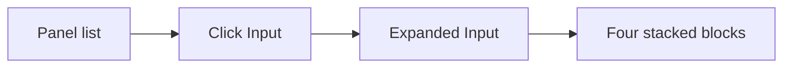

# Input panel and input blocks

## Context

- Panel labels and expand/collapse UI live in [`../src/side-panel-expandable-panels.jsx`](../src/side-panel-expandable-panels.jsx). The first entry in `PANELS` is `'Panel 1'`; expanded content is currently a single placeholder paragraph.

```3:9:src/side-panel-expandable-panels.jsx
const PANELS = [
  'Panel 1',
  'Panel 2',
  ...
]
```

- Styling for the expanded body uses `.sp-panel-expanded-body` and `.sp-panel-expanded-placeholder` in [`../src/App.css`](../src/App.css) (lines ~340–352).

## Changes

### 1. Rename first panel to Input

- In [`../src/side-panel-expandable-panels.jsx`](../src/side-panel-expandable-panels.jsx), change the first `PANELS` string from `'Panel 1'` to `'Input'`.

### 2. New folder `../src/input-blocks/`

Add small presentational components (one file per block, kebab-case to match [`../src/side-panel.jsx`](../src/side-panel.jsx) / [`../src/mini-map.jsx`](../src/mini-map.jsx)):

| File                                                                             | Role                                                                                                                                 |
| -------------------------------------------------------------------------------- | ------------------------------------------------------------------------------------------------------------------------------------ |
| [`../src/input-blocks/binary-block.jsx`](../src/input-blocks/binary-block.jsx)   | Block titled Binary with a short description + controlled or local `<textarea>` (placeholder text only unless you later wire state). |
| [`../src/input-blocks/hex-block.jsx`](../src/input-blocks/hex-block.jsx)         | Same pattern for Hex.                                                                                                                |
| [`../src/input-blocks/decimal-block.jsx`](../src/input-blocks/decimal-block.jsx) | Same for Decimal.                                                                                                                    |
| [`../src/input-blocks/ascii-block.jsx`](../src/input-blocks/ascii-block.jsx)     | Same for ASCII.                                                                                                                      |
| [`../src/input-blocks/input-blocks.jsx`](../src/input-blocks/input-blocks.jsx)   | Composes all four in order inside a wrapper (e.g. `div.input-blocks`) with consistent spacing.                                       |

No cross-format conversion in this pass unless you ask for it later; each block is a distinct UI “slot” for that representation.

### 3. Wire Input expanded view to `input-blocks`

- In [`../src/side-panel-expandable-panels.jsx`](../src/side-panel-expandable-panels.jsx), import the composed component from `./input-blocks/input-blocks.jsx`.
- Replace the expanded-body placeholder **only when** the expanded panel is Input (e.g. `PANELS[expandedIndex] === 'Input'` or `expandedIndex === 0`). Other panels keep the existing `Content for {title}.` placeholder.

### 4. CSS

- In [`../src/App.css`](../src/App.css), add a compact block stack: wrapper gap, per-block card (border/radius aligned with `.sp-panel-expanded`), block title, optional hint text, and `textarea` styles (min-height, monospace where appropriate for binary/hex/ascii, readable font for decimal).

## User flow (unchanged except copy + content)



After opening the side drawer and tapping **Input**, the expanded region shows **Input** as the title and the four stacked blocks below (per your choice: all visible, scroll if needed).

## Files touched

- Edit: [`../src/side-panel-expandable-panels.jsx`](../src/side-panel-expandable-panels.jsx), [`../src/App.css`](../src/App.css)
- Create: [`../src/input-blocks/binary-block.jsx`](../src/input-blocks/binary-block.jsx), [`../src/input-blocks/hex-block.jsx`](../src/input-blocks/hex-block.jsx), [`../src/input-blocks/decimal-block.jsx`](../src/input-blocks/decimal-block.jsx), [`../src/input-blocks/ascii-block.jsx`](../src/input-blocks/ascii-block.jsx), [`../src/input-blocks/input-blocks.jsx`](../src/input-blocks/input-blocks.jsx)
